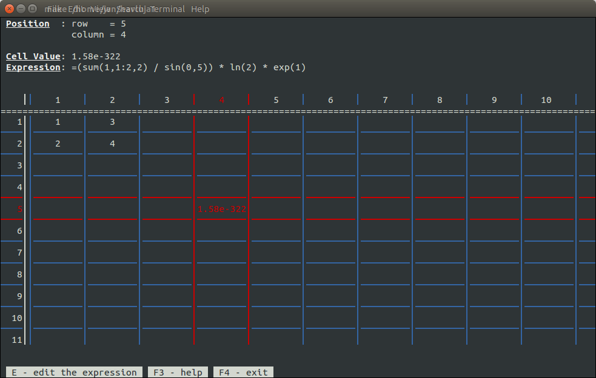
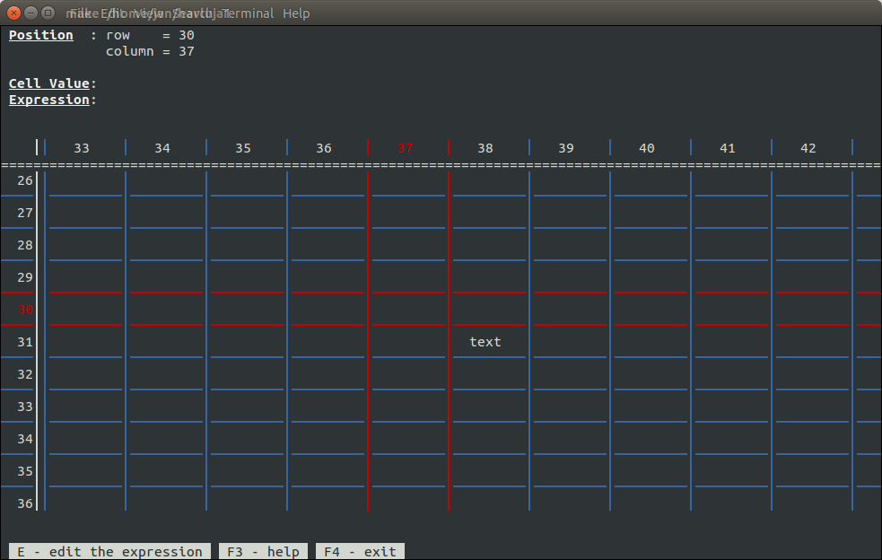
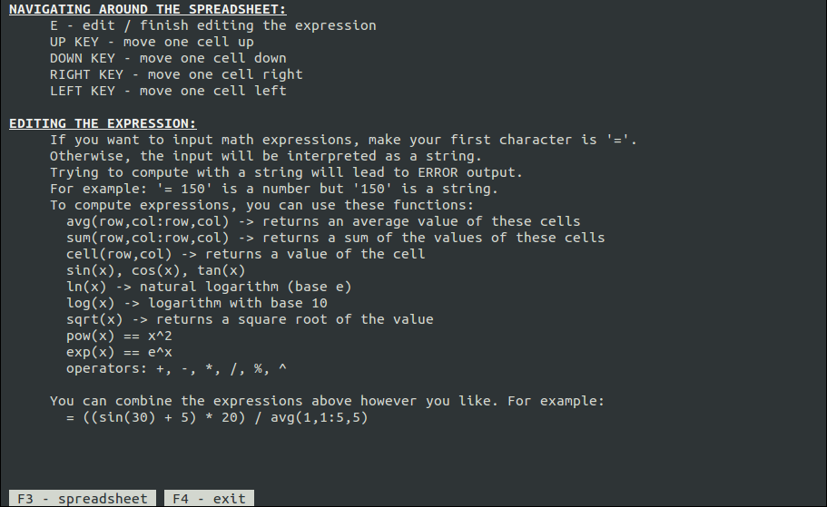

## Disclaimer
This repository contains code that I wrote when studying Software Engineering at Czech Technical University in Prague.

The objective of these assignments was to write code that works, covers all edge cases, and is somewhat performant. Usually, there were additional rules we had to follow - like limits on the amount of memory our programs could use or that all code needed to be in a single file 🤷‍♂️.

Please keep in mind that I wrote this code years ago and that it was a school assignment. This repository does not serve as the best example of my coding skills.

# CLI spreadsheet editor
I implemented this project as a semester project for [Programming and Algorithms](https://edux.fit.cvut.cz/courses/BI-PA2/en/start) class I have taken.

It is a simple CLI spreadsheet editor that lets you do basic computation within each cell, as well as reference other cells. You can use any valid mathematical expression (+, -, /, \*, ^, %) and these functions: sum, avg, sin, cos, tan, ln, log, sqrt, pow, exp.

## Screenshots

## How to compile & run
- You should have ncurses installed (apt-get install libncurses-dev)
- `make all` (or `make compile` and `make doc`) to compile and build the documentation
- `make clean` to clean the project folder
- `make run` (or `./spreadsheet`)
- to generate the documentation, you need to have doxygen installed

## Original assignment (in Czech)
Jednoduchý spreadsheet editor vytvořený pomocí ncurses. Do buňek je možné zadávat jednoduché výrazy (jako v kalkulačce). Editor detekuje cykly a nepovolí vytvoření výrazu, který by cyklus způsbil. Pokud je mi známo, tak parsování závorek byla jako ukázka na prosemináři, tedy zkuste naprogramovat spreadsheet tak aby bylo možné zpracovat výrazy typu: ((A1+5)/B5)-A5. Jednodušší verze je udělat výrazy bez závorek (např. A1+5/B5-A5), ovšem potom s funkcemi aplikovatelnými na sloupce/řádky typu SIN, AVG, SUM, apod.

Tento text má rámcově vymezit téma semestrální práce. Podrobnější podmínky viz. Edux.
